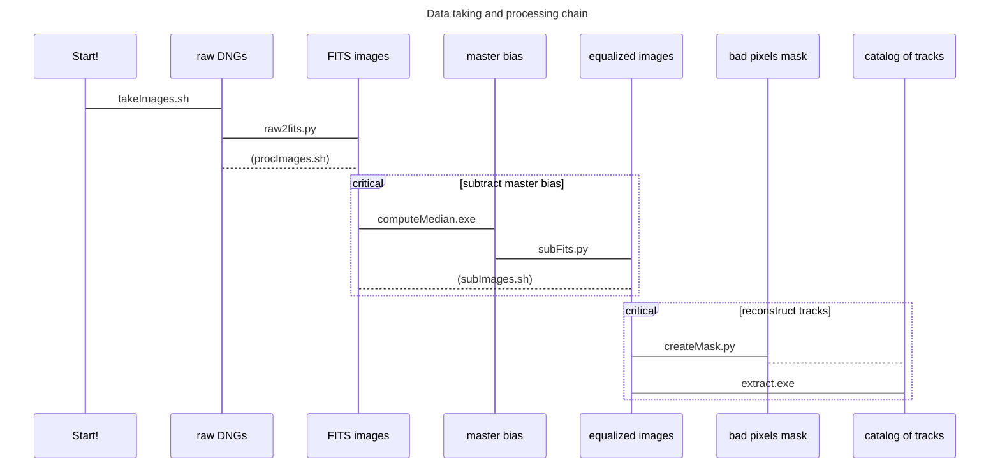

# RPi HQ camera for particle detection

Set of scripts, software and documentation to process images taken with the RPi HQ camera for particle detection.




+ **takeImages.sh**: script that runs in the RPi to take raw images in DNG format
+ **raw2fits.py**: reads raw data in DNG format and produces a FITS image
+ **subFits.py**: subtracts two FITS images
+ **fits2root.py**: converts a FITS images to a ROOT TTree
+ **createMask.py**: marks as bad the pixels that are above threshold more than 30\% of the time
+ **extract.exe**: identifies and reconstructs the tracks and saves them to a ROOT catalog
+ **fullProc.sh**: runs the full processing and reconstruction chain

## Automated reconstruction

To run the full processing and reconstruction chain (from raw DNG files to a ROOT catalog):

```
cd <directory where the DNG files are>
$muPi/fullProc.sh
```

where $muPi is the directory that contains all the processing tools (this directory after clonning!)