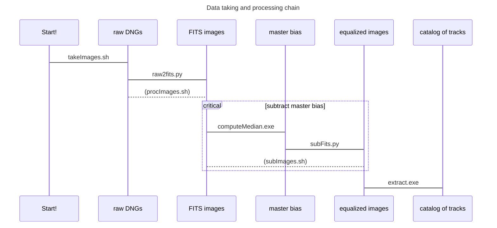

# RPi HQ camera for particle detection

Set of scripts, software and documentation to process images taken with the RPi HQ camera for particle detection.

+ **takeImages.sh**: script that runs in the RPi to take raw images in DNG format
+ **raw2fits.py**: reads raw data in DNG format and produces a FITS image
+ **subFits.py**: subtracts two FITS images
+ **fits2root.py**: converts a FITS images to a ROOT TTree